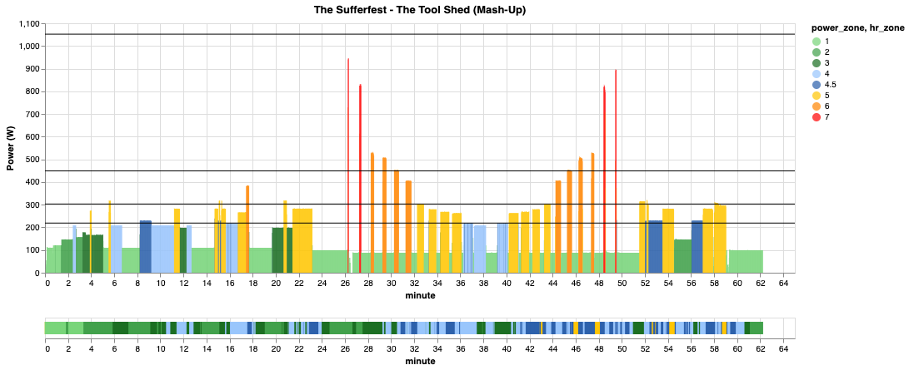

# fitvis

A experimental data visualizations for cycling and fitness data.
Creates simple visualizations for you cycling workouts with integration with zone analysis and relationships the 4DP fitness test.

| Spec                        | Value                |
| --------------------------- | -------------------- |
| OS                          | 10.15.6 (Catalina)   |
| Model Name:                 | MacBook Pro          |
| Model Identifier:           | MacBookPro16,1       |
| Processor Name:             | 8-Core Intel Core i9 |
| Processor Speed:            | 2.3 GHz              |
| Number of Processors:       | 1                    |
| Total Number of Cores:      | 8                    |
| L2 Cache (per Core):        | 256 KB               |
| L3 Cache:                   | 16 MB                |
| Hyper-Threading Technology: | Enabled              |
| Memory:                     | 16 GB                |
